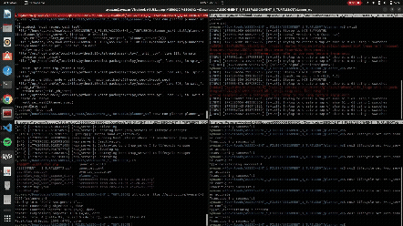

# SC627-Assignment-1
This repo contains all the code and results of Assignment 1 of the course SC 627 : Motion Planning and Coordination of Autonomous Vehicles. This is an individual assignment

## A* vs GVD simulation video

*Figure: A* vs GVD simulation video.*